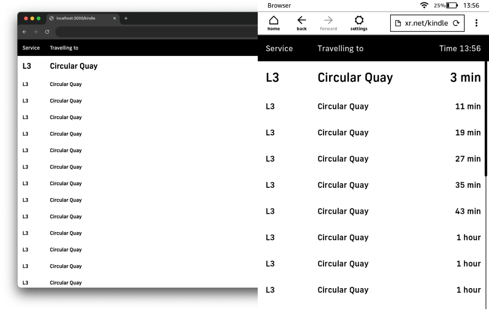

<a href="#gh-light-mode-only">

</a>
<a href="#gh-dark-mode-only">

</a>
  
# Lightrail Board

Lightrail Board is a tool for displaying realtime* lightrail data for a given stop on a easy to consume page, formatted similar to the real-life dynamic signage on the lightrail stops.

Specifically I created this project to both gain an understanding of the TransportNSW Data API and to have some way to show my possible next lightrail journey in my own home.

<small>* Realtime data requires a refresh of the page to update</small>

> [!CAUTION]
> This repository is a work-in-progress. Your mileage may vary.


## Quickstart (Local)

The most convenient way to use this repository is to use a `docker-compose.yml`.

- [Docker](https://www.docker.com/)
- [Docker Compose](https://docs.docker.com/compose/)
- [Open Data Hub API Key](https://opendata.transport.nsw.gov.au/get-started)

> [!WARNING]
> The fonts used in this project, specifically the NewFrank font, are not free for commercial use.
> 
> These are BYO fonts, and are not included in this repository.
   
1. Create a `docker-compose.yaml`.
   ```yaml
   version: "3.9"
   services:
     lightrail_board:
       container_name: lightrail-board
       image: ghcr.io/jakehwll/lightrail-board:latest
       environment:
         - TFNSW_API_KEY=${TFNSW_API_KEY:-}
         - TFNSW_STOP_ID=${TFNSW_STOP_ID:-}
         # If you want to ignore certain stop destinations, you can do so here.
         # - TFNSW_STOP_IGNORED="1234,5678"
       # If you have `NewFrank-*.(woff|woff2)` locally you can set them up to serve here.
       # volumes:
       #   - ${ASSET_DIR:-}:/usr/src/app/static
       ports:
         - "${PORT:-3000}:3000"
       restart: unless-stopped
   ```

2. Run the newly created `docker-compose.yaml`
   ```sh
   docker-compose up -d
   ```

## Development

To run the application locally, you will need to install the following:

- [Bun](https://bun.sh/)
- [Open Data Hub API Key](https://opendata.transport.nsw.gov.au/get-started)

```sh
# Install the appropriate dependencies
bun install
# Populate your API key in the `.env`
cp .env.example .env.local
# Run the application
bun dev
```

## Routes

| Route | Description | Preview |
| --- | --- | --- |
| `/board` | Displays a live board with the latest departures, requires a refresh of the page to update. |  |
| `/kindle` | Displays a live board with the latest departures optimised for e-Ink/Kindle display, refreshed automatically every 30 seconds. |  |